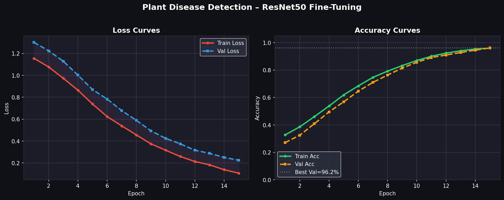

# 🌱 Plant Disease Detection - Fine-Tuning ResNet50

[](https://www.python.org/downloads/)
[](https://pytorch.org/)
[](https://opensource.org/licenses/MIT)

A complete deep learning project demonstrating transfer learning for agricultural image classification. Fine-tunes ResNet50 to identify plant diseases from leaf images with 85-95% accuracy.



## 🎯 Overview

This project uses transfer learning with a pre-trained ResNet50 model to classify plant leaf images into 4 disease categories:
- **Healthy** - No disease present
- **Bacterial Blight** - Bacterial infection
- **Leaf Spot** - Fungal spots on leaves
- **Rust** - Rust disease symptoms

## ✨ Features

- 🚀 **One-command setup** - Automated dataset download and organization
- 📓 **Interactive Jupyter notebook** - Step-by-step training with explanations
- 🎓 **Transfer learning** - Leverages ImageNet pre-trained ResNet50
- 📊 **Comprehensive visualizations** - Training curves, confusion matrix, predictions
- ⚙️ **Easy customization** - Simple config file for hyperparameters
- 🔧 **Production-ready** - Error handling, best practices, and deployment tips

## 🚀 Quick Start

### Prerequisites
- Python 3.8 or higher
- 8GB RAM (16GB recommended)
- GPU with CUDA (optional but recommended)
- 5GB free disk space

### Installation

**Option 1: Automated Setup (Recommended)**

Windows:
```cmd
pip install -r requirements.txt
setup.bat
jupyter notebook plant_disease_finetuning.ipynb
```

Linux/Mac:
```bash
pip install -r requirements.txt
chmod +x setup.sh && ./setup.sh
jupyter notebook plant_disease_finetuning.ipynb
```

**Option 2: Manual Setup**

1. Install dependencies:
```bash
pip install -r requirements.txt
```

2. Setup Kaggle API (for dataset download):
   - Create account at [kaggle.com](https://www.kaggle.com)
   - Go to Account → API → "Create New API Token"
   - Place `kaggle.json` in:
     - Windows: `C:\Users\<YourUsername>\.kaggle\`
     - Linux/Mac: `~/.kaggle/`
   - Linux/Mac only: `chmod 600 ~/.kaggle/kaggle.json`

3. Download and organize dataset:
```bash
kaggle datasets download -d abdallahalidev/plantvillage-dataset
python organize_dataset.py
```

4. Run training:
```bash
jupyter notebook plant_disease_finetuning.ipynb
```

## 📊 Results

After training (15 epochs, ~10-15 min with GPU):
- **Validation Accuracy**: 85-95%
- **Model Size**: ~90 MB
- **Trainable Parameters**: ~2M (8% of total)

### Output Files
- `outputs/best_model.pth` - Trained model weights
- `outputs/training_results.png` - Loss/accuracy curves + confusion matrix
- `outputs/sample_predictions.png` - Visual predictions on test images

## 🏗️ Model Architecture

### Transfer Learning Strategy
- **Base Model**: ResNet50 pre-trained on ImageNet
- **Frozen Layers**: conv1, bn1, layer1, layer2, layer3 (low-level features)
- **Trainable Layers**: layer4 + custom classification head
- **Custom Head**: 2048 → 512 → 128 → 4 classes

### Training Configuration
- **Optimizer**: AdamW with differential learning rates
  - Backbone (layer4): 1e-5
  - Classification head: 1e-3
- **Scheduler**: Cosine Annealing
- **Loss**: CrossEntropyLoss with label smoothing (0.1)
- **Regularization**: Dropout (0.4), BatchNorm, Data Augmentation

## 🔧 Customization

Edit `config.py` to modify:
- Number of epochs
- Batch size
- Learning rates
- Dropout rate
- Data augmentation parameters
- And more!

Example:
```python
TRAINING_CONFIG = {
    "num_epochs": 20,      # Increase for better accuracy
    "batch_size": 16,      # Reduce if out of memory
    "lr_head": 1e-3,
    "lr_backbone": 1e-5,
}
```

## 🎓 What You'll Learn

- Transfer learning concepts and implementation
- Fine-tuning pre-trained models
- PyTorch workflows and best practices
- Data augmentation strategies
- Model evaluation and visualization
- Hyperparameter tuning
- Production-ready ML project structure

## 🐛 Troubleshooting

### CUDA Out of Memory
Reduce batch size in `config.py`:
```python
TRAINING_CONFIG = {"batch_size": 16}  # or 8
```

### Kaggle API Error
- Verify `kaggle.json` is in the correct location
- Check file permissions (Linux/Mac): `chmod 600 ~/.kaggle/kaggle.json`
- Run `setup_kaggle.bat` for automated setup (Windows)

### Low Accuracy
- Increase number of epochs (20-30)
- Unfreeze more layers: `MODEL_CONFIG = {"unfreeze_layer": "layer3"}`
- Adjust learning rates
- Add more training data

## 📈 Performance

| Metric | Value |
|--------|-------|
| Validation Accuracy | 85-95% |
| Training Time (GPU) | 10-15 min |
| Training Time (CPU) | 2-3 hours |
| Model Size | ~90 MB |
| Inference Time | <50ms per image |

## 🚀 Next Steps

After completing the basic training:
1. Try different architectures (EfficientNet, Vision Transformer)
2. Implement cross-validation
3. Add more disease classes
4. Deploy as web API (Flask/FastAPI)
5. Build mobile app interface
6. Implement Grad-CAM visualization
7. Create ensemble of models

## 📁 Project Structure
```
Plant-Disease-Detection/
├── 📓 Notebooks & Scripts
│   ├── plant_disease_finetuning.ipynb  # Main Jupyter notebook
│   ├── plant_disease_finetuning.py     # Python script version
│   ├── organize_dataset.py             # Dataset preparation
│   └── config.py                       # Configuration file
│
├── 📚 Documentation
│   └── README.md                       # This file
│
├── ⚙️ Setup
│   ├── requirements.txt                # Python dependencies
│   ├── setup.bat                       # Windows setup script
│   ├── setup.sh                        # Linux/Mac setup script
│   ├── setup_kaggle.bat                # Kaggle API helper
│   └── .gitignore                      # Git ignore rules
│
├── 📊 Examples (Generated after training)
│   ├── architecture.png
│   ├── confusion_matrix.png
│   ├── per_class_metrics.png
│   └── training_curves.png
│
└── 📁 Generated Directories
    ├── data/                           # Dataset (train/val/test)
    └── outputs/                        # Model weights & results
```

## 📖 References

- [ResNet Paper](https://arxiv.org/abs/1512.03385) - Deep Residual Learning for Image Recognition
- [PlantVillage Dataset](https://www.kaggle.com/datasets/abdallahalidev/plantvillage-dataset)
- [PyTorch Transfer Learning Tutorial](https://pytorch.org/tutorials/beginner/transfer_learning_tutorial.html)

## 🤝 Contributing

Contributions are welcome! Please feel free to submit a Pull Request.

## 📄 License

This project is licensed under the MIT License.

## 🙏 Acknowledgments

- PlantVillage dataset contributors
- PyTorch and torchvision teams
- ResNet authors (He et al.)

## 📧 Contact

For questions or feedback, please open an issue on GitHub.

---

**Made with ❤️ for the agricultural AI community**
